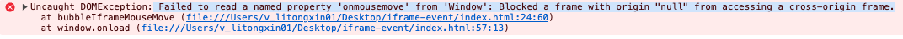

# iframe 事件不能穿透解决方案

## 方案一

pointer-events 作用： 在什么情况下 (如果有) 某个特定的图形元素可以成为鼠标事件的 target

通过设置 pointer-events 属性，将 iframe 的鼠标事件穿透到父元素

问题： pointer-events: none 会禁止 iframe 上的所有鼠标事件，包括 iframe 的子元素

解决方案： 将 css pointer-events: none 改动动态设置

*** 值 ***

1. auto
    与pointer-events属性未指定时的表现效果相同，对于 SVG 内容，该值与visiblePainted效果相同
2. none(适用于所有元素)
    元素永远不会成为鼠标事件的target。但是，当其后代元素的pointer-events属性指定其他值时，鼠标事件可以指向后代元素，在这种情况下，鼠标事件将在捕获或冒泡阶段触发父元素的事件侦听器。

3. visiblePainted
    只适用于 SVG。元素只有在以下情况才会成为鼠标事件的目标：

    visibility属性值为visible，且鼠标指针在元素内部，且fill属性指定了none之外的值
    visibility属性值为visible，鼠标指针在元素边界上，且stroke属性指定了none之外的值
4. visibleFill
    只适用于 SVG。只有在元素visibility属性值为visible，且鼠标指针在元素内部时，元素才会成为鼠标事件的目标，fill属性的值不影响事件处理。
5. visibleStroke
    只适用于 SVG。只有在元素visibility属性值为visible，且鼠标指针在元素边界时，元素才会成为鼠标事件的目标，stroke属性的值不影响事件处理。
6. visible
    只适用于 SVG。只有在元素visibility属性值为visible，且鼠标指针在元素内部或边界时，元素才会成为鼠标事件的目标，fill和stroke属性的值不影响事件处理。
7. painted
    只适用于 SVG。元素只有在以下情况才会成为鼠标事件的目标：

    鼠标指针在元素内部，且fill属性指定了none之外的值
    鼠标指针在元素边界上，且stroke属性指定了none之外的值
    visibility属性的值不影响事件处理。
8. fill
    只适用于 SVG。只有鼠标指针在元素内部时，元素才会成为鼠标事件的目标，fill和visibility属性的值不影响事件处理。
9. stroke
    只适用于 SVG。只有鼠标指针在元素边界上时，元素才会成为鼠标事件的目标，stroke和visibility属性的值不影响事件处理。
10. all
    只适用于 SVG。只有鼠标指针在元素内部或边界时，元素才会成为鼠标事件的目标，fill、stroke和visibility属性的值不影响事件处理。


## 方案二
在主窗口和 iframe 之间建立事件监听关系，在 iframe 中触发事件
问题： 无法操作 跨域的 iframe 脚本


解决方案：对嵌入的资源配置内容安全策略

```js
// This example assumes execution from the parent of the the iframe

function bubbleIframeMouseMove(iframe){
    // Save any previous onmousemove handler
    var existingOnMouseMove = iframe.contentWindow.onmousemove;

    // Attach a new onmousemove listener
    iframe.contentWindow.onmousemove = function(e){
        // Fire any existing onmousemove listener 
        if(existingOnMouseMove) existingOnMouseMove(e);

        // Create a new event for the this window
        var evt = document.createEvent("MouseEvents");

        // We'll need this to offset the mouse move appropriately
        var boundingClientRect = iframe.getBoundingClientRect();

        // Initialize the event, copying exiting event values
        // for the most part
        evt.initMouseEvent( 
            "mousemove", 
            true, // bubbles
            false, // not cancelable 
            window,
            e.detail,
            e.screenX,
            e.screenY, 
            e.clientX + boundingClientRect.left, 
            e.clientY + boundingClientRect.top, 
            e.ctrlKey, 
            e.altKey,
            e.shiftKey, 
            e.metaKey,
            e.button, 
            null // no related element
        );

        // Dispatch the mousemove event on the iframe element
        iframe.dispatchEvent(evt);
    };
}

// Get the iframe element we want to track mouse movements on
var myIframe = document.getElementById("myIframe");

// Run it through the function to setup bubbling
bubbleIframeMouseMove(myIframe);
```